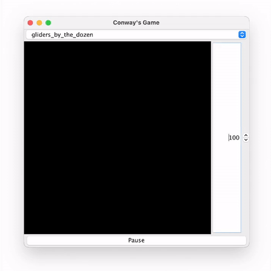

# Conway's Game of Life in Java

This is a Java implementation of Conway's Game of Life using Swing for the graphical interface.

## Table of Contents
- [Introduction](#introduction)
- [Features](#features)
- [How to run](#howtorun)
- [Usage](#usage)
- [License](#license)

## Introduction
Conway's Game of Life is a cellular automaton devised by the British mathematician John Horton Conway in 1970. The game consists of a grid of cells that can live, die, or multiply based on a few mathematical rules. The goal of the game is to observe the evolution of patterns over time.

## Features
- Simple and intuitive graphical user interface using Swing.
- Configurable grid size.
- Adjustable simulation speed.

## How to run
- Clone the project
- Run it with gradle `./gradlew run`

## Usage
- Open the application.
- Configure the grid size.
- Click on the field to add pattern.
- Adjust the speed of the simulation using the controls.

## License
This project is licensed under the MIT License.

## Acknowledgements
This project is dedicated to the memory of John Horton Conway (1937-2020), the brilliant mathematician who created the Game of Life. His work has inspired countless enthusiasts and professionals in mathematics, computer science, and beyond. Conway's Game of Life remains a profound example of how simple rules can lead to complex and beautiful patterns, embodying the essence of mathematical discovery and exploration.